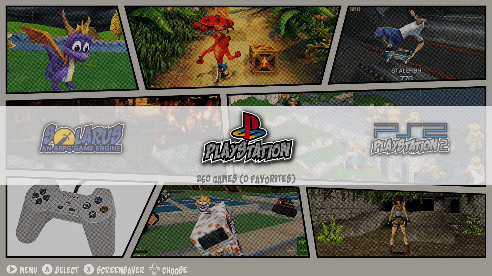
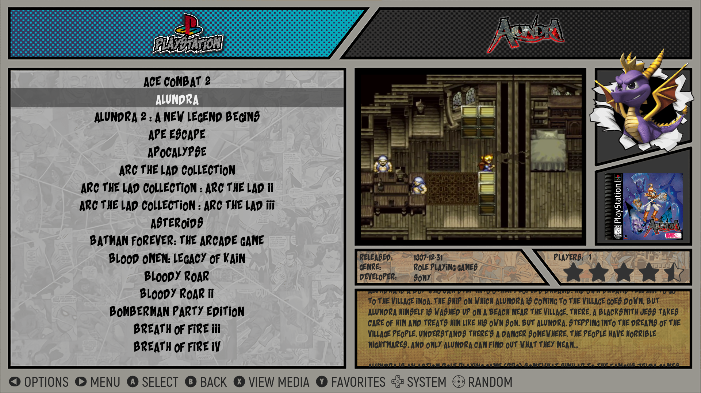
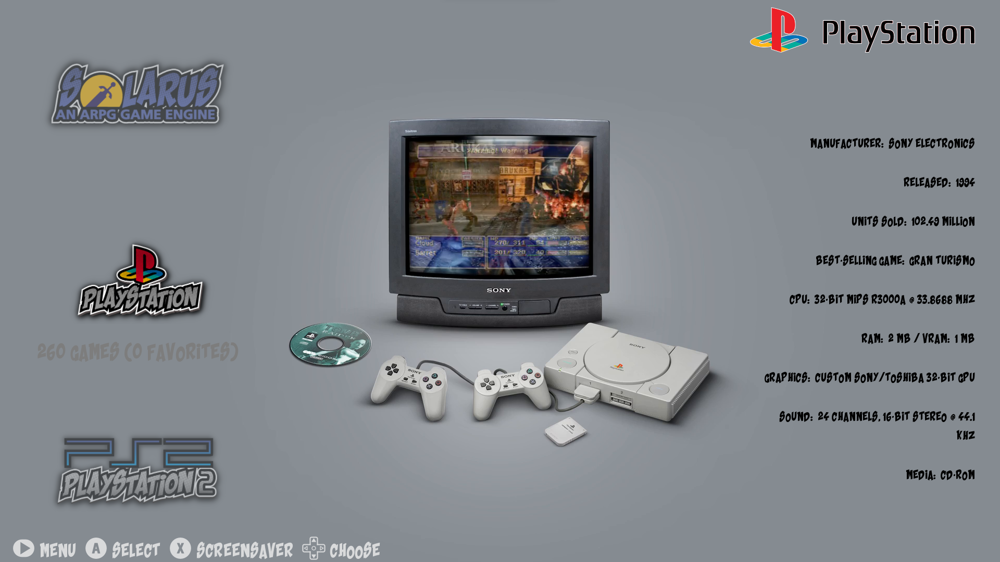
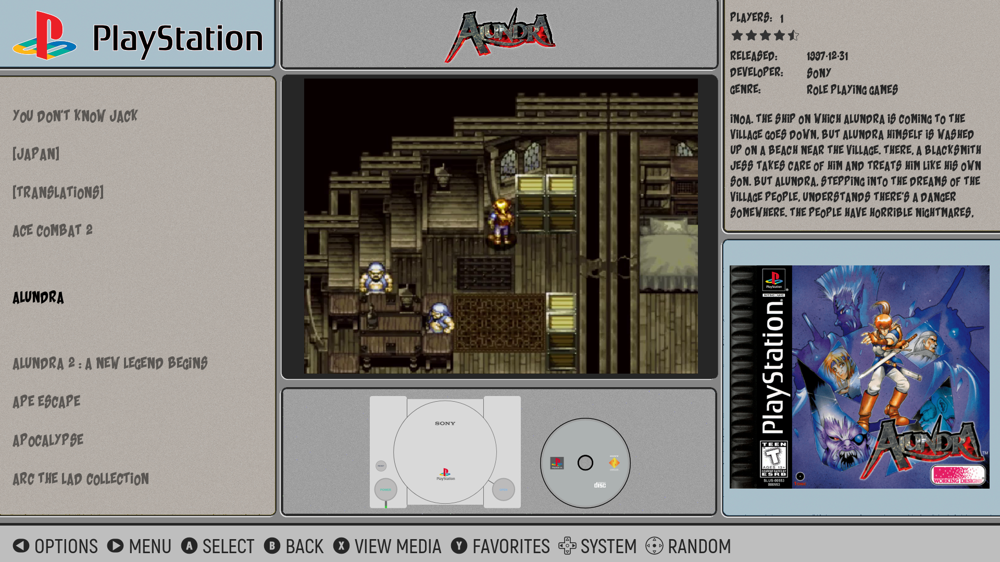

# Overview

This is port of the original comic book theme to the new Emulation Station DE theme engine.

## Variants

There are 2 variants: Classic and Modern.

- Classic should look very much like the original implementation for retropie

- Modern tries out some of the new capabilities in the desktop edition, with a focus on making videos and images more of a focus.

## Credits

https://github.com/TMNTturtleguy/es-theme-ComicBook

https://es-de.org/

https://sites.google.com/view/comicthemelogos/home

https://forums.launchbox-app.com/files/file/1958-colorful-platform-video-set/

## Screenshots

Classic (Console View):

Classic (Gamelist View)

Modern (Console View)

Modnern (Gamelist View)

